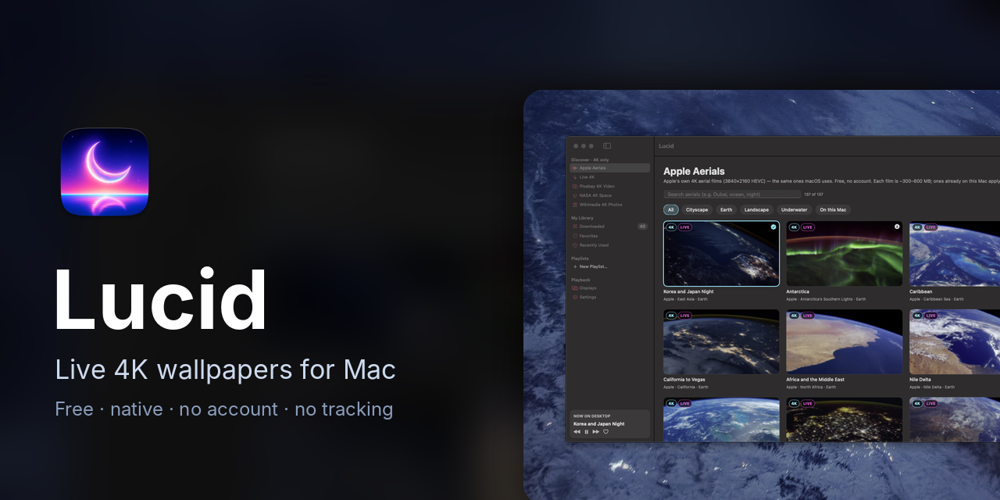
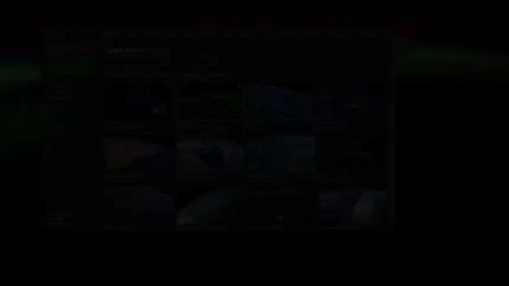
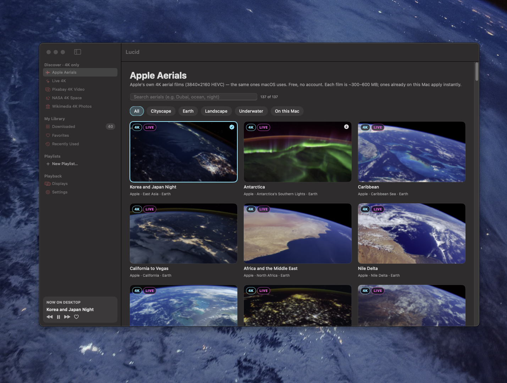
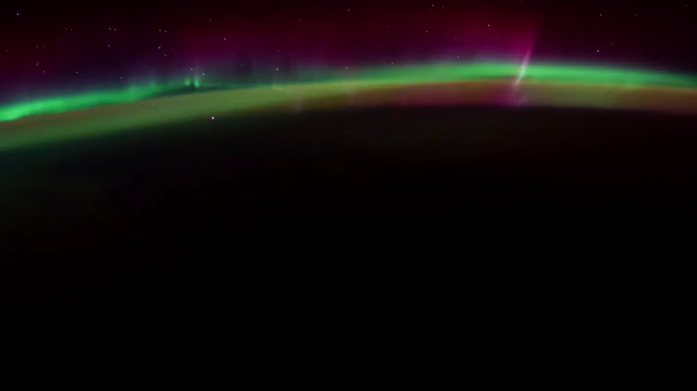

<p align="center">
  
</p>

<p align="center">
  <b>Live 4K wallpapers for your Mac.</b><br>
  Moving space, nature and ocean on every display. Free, native, no account, no tracking.
</p>

<p align="center">
  <a href="https://github.com/jedbrnth-eng/lucid-live-wallpaper/actions/workflows/ci.yml"></a>
  <a href="https://github.com/jedbrnth-eng/lucid-live-wallpaper/releases/latest"></a>
  
  
  
  <a href="LICENSE"></a>
</p>

<p align="center">
  <a href="#install-in-10-seconds">Install</a> ·
  <a href="#whats-inside">Features</a> ·
  <a href="#bring-your-own">Bring your own</a> ·
  <a href="#where-the-wallpapers-come-from">Sources</a> ·
  <a href="#privacy">Privacy</a>
</p>

<p align="center">
  <a href="docs/demo.mp4"></a><br>
  <sub>Pick a wallpaper, click Apply, and the desktop changes. <a href="docs/demo.mp4">Watch in full HD</a>.</sub>
</p>

---

## Install in 10 seconds

Open **Terminal** (press `⌘ Space`, type `Terminal`, press Return), paste this line, and press Return:

```bash
curl -fsSL https://raw.githubusercontent.com/jedbrnth-eng/lucid-live-wallpaper/main/install.sh | bash
```

Lucid downloads, lands in your Applications folder and opens. Lucid isn't notarized by Apple yet, so the installer clears macOS's download flag for you.

<sub>Needs an Apple Silicon Mac (M1 or newer) on macOS 14 Sonoma or later. Want to read the script first? It's [install.sh](install.sh), about 40 lines. The app is open source, so you can read every line it runs.</sub>

<details>
<summary><b>Other ways to install</b></summary>

<br>

**Download the zip.** Get `Lucid.zip` from [Releases](https://github.com/jedbrnth-eng/lucid-live-wallpaper/releases/latest), unzip it and drag **Lucid.app** to Applications. Because a browser downloaded it, macOS will warn that it can't verify the app. Fix that once with:

```bash
xattr -dr com.apple.quarantine /Applications/Lucid.app
```

**Build it yourself** (about a minute, needs Xcode Command Line Tools):

```bash
xcode-select --install          # once
git clone https://github.com/jedbrnth-eng/lucid-live-wallpaper.git
cd lucid-live-wallpaper
./build.sh                      # creates build/Lucid.app
open build/Lucid.app
```

**Uninstall:**

```bash
rm -rf /Applications/Lucid.app "$HOME/Library/Application Support/Lucid"
```

</details>

## Take a look

<p align="center">
  
</p>

<p align="center">
  <a href="docs/aurora.mp4"></a><br>
  <sub>A live aurora wallpaper on the desktop. <a href="docs/aurora.mp4">Watch in full HD</a>.</sub>
</p>

## What's inside

| Feature | |
|---|---|
| **Live 4K catalog** | About 590 curated moving wallpapers from ESA/Webb, ESA/Hubble, ESO, NASA and Wikimedia Commons. Browse by category (Space, Nature & Landscapes, Ocean & Beaches, Sky & Time-lapse, Cities). Every clip is verified at 3840×2160 or larger and turned into a seamless loop. |
| **Apple Aerials** | Apple's own 4K aerial films. The ones already on your Mac apply instantly; others download from Apple when you pick them. |
| **Stills** | NASA 4K Space and Wikimedia 4K Photos, with the license shown on every item. |
| **Your own library** | Drag in your own videos and photos, or whole folders. Anything below 4K is flagged. |
| **Every display** | A different wallpaper on each monitor, playlists, favorites, an auto-change timer, and open at login. Switch to a recent wallpaper straight from the menu bar. |
| **Battery-friendly** | Pauses when covered, in Low Power Mode, on battery, when the screen locks or the display sleeps. |
| **Private by design** | No account, no analytics, no telemetry. Native SwiftUI and AppKit, no dependencies. |

## Use it

1. Open Lucid. It also lives in your menu bar.
2. In **Discover**, hover a wallpaper and click **Apply**.
3. Have more than one screen? Open a wallpaper and use **Set on Display**.

## Bring your own

Three ways, pick whichever is easiest:

- **Drag and drop** videos, photos or whole folders onto the Lucid window or its Dock icon.
- Click **Import…** on the **Downloaded** page.
- Drop files straight into `~/Library/Application Support/Lucid/Media`. They appear on their own within seconds.

MP4 and MOV work as they are. WebM, MKV and similar formats are converted to HEVC automatically. Your files show up under **Downloaded → My Files**.

## Where the wallpapers come from

**This repo contains no wallpaper media.** `catalog.json` is a list of links and credits. The app downloads clips from their original sources onto your Mac, and shows the credit and license for every item.

The wallpapers belong to their creators, each under its own license, and the app shows the credit and license for every item:
- **NASA:** generally public domain. Credit NASA, and don't imply endorsement.
- **ESA/Webb, ESA/Hubble, ESO:** CC BY 4.0. Soundtrack music is licensed separately, so the loop maker removes audio. ESO footage of identifiable people is not for commercial use.
- **Wikimedia Commons:** per file (CC0, CC BY, CC BY-SA…). Credit the author if you share a file.
- **Apple Aerials:** Apple content that ships with macOS, for personal use on your Mac only. It is never bundled or redistributed.
- **Pixabay:** free to use, but files must not be redistributed as-is.

Loops are modified (cross-faded, re-encoded) copies for **personal use on your own Mac**. If you republish any of them, follow each item's license, including attribution and share-alike. Full research notes: [`SOURCES.md`](SOURCES.md).

## How it works

Each display gets a borderless window at desktop level, above the system wallpaper and below the desktop icons, holding a muted, hardware-decoded looping `AVQueuePlayer`. A frame from the video is also set as the real desktop picture, so Mission Control and other Spaces show a matching still.
Data lives in `~/Library/Application Support/Lucid/`.

## Project layout

```
Sources/Lucid/
├── App/        entry point, app delegate, menu bar, file import
├── Core/       models, paths, preferences, Keychain
├── Content/    content providers and the curated Live 4K catalog
├── Engine/     per-display wallpaper windows and the downloader
├── Media/      transcoding and seamless loop maker
├── Store/      app state shared by the views
└── Views/      SwiftUI screens and components
tools/          catalog builder and its tests
```

## Privacy

No analytics or telemetry. The app only contacts the content sources above (NASA, ESA, ESO, Wikimedia Commons, Apple's servers for Aerial films you choose, and Pixabay if you add a key) to browse and download what you choose.

## Test

```
./selftest.sh                                      # every source returns only ≥3840×2160 items
python3 -m unittest tools/test_build_catalog.py    # offline catalog-builder tests
python3 tools/build_catalog.py catalog.json        # rebuild the Live 4K catalog (slow)
```

## Contributing

Issues and pull requests are welcome. See [CONTRIBUTING.md](CONTRIBUTING.md). Release history is in [CHANGELOG.md](CHANGELOG.md).

## License

The code is [MIT](LICENSE) licensed. Wallpaper content stays under its creators' licenses, as above.

*Not affiliated with or endorsed by Apple, NASA, ESA, ESO, Wikimedia or Pixabay.*
